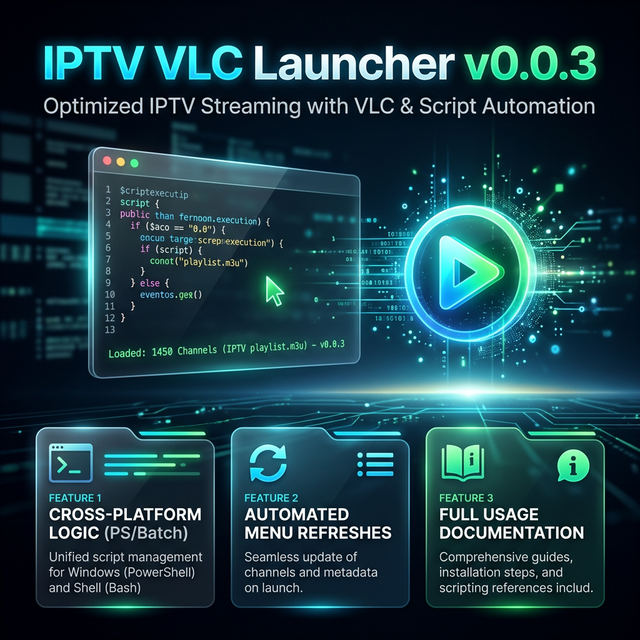

# IPTV VLC Launcher

  

A lightweight, menu-driven PowerShell, Batch, and Bash launcher for streaming global IPTV playlists directly in VLC Media Player, categorized by region, language, and genre.

## Why and What it is Created For

**What it is:** A simple command-line interface tool that provides an interactive menu with 25 distinct streaming options. 
**Why it was created:** It simplifies the process of accessing thousands of free, publicly available live TV channels from around the world (sourced from `iptv-org/iptv`). Instead of manually hunting for `.m3u` URLs, downloading files, or pasting links into VLC, this tool automates the process. You simply pick a category, and the script launches VLC with the correct stream loaded instantly.

## How to Use It

### Prerequisites
- **VLC Media Player** must be installed on your machine.
  - **Windows**: Default path `C:\Program Files\VideoLAN\VLC\` or `C:\Program Files (x86)\VideoLAN\VLC\`.
  - **Linux/macOS**: VLC must be available via `vlc` in your `PATH`, or installed at `/usr/bin/vlc` or `/Applications/VLC.app`.

### Running the Launcher
Choose the script that matches your operating system:

1. **PowerShell Edition `IPTV_Launcher.ps1` (Windows — Recommended)**:
   - Open PowerShell and execute: `.\IPTV_Launcher.ps1`
   - Alternatively, right-click the file and select "Run with PowerShell".
   - Features a modern, multi-colored interface.

2. **Batch Edition `IPTV_Launcher.bat` (Windows)**:
   - Simply double-click on `IPTV_Launcher.bat` to run.

3. **Bash Edition `IPTV_Launcher.sh` (Linux / macOS)**:
   - Make it executable first: `chmod +x IPTV_Launcher.sh`
   - Then run it: `./IPTV_Launcher.sh`
   - Features the same colored terminal output as the PowerShell version.

### Selecting a Stream
- Once the script runs, you'll see a menu offering choices numbered `1` through `25`.
- **Type the number** representing the specific region, category (e.g., Movies, News, Sports), or language you want to watch.
- Press **Enter**.
- VLC will open automatically and begin resolving the playlist. Use VLC's playlist view (`Ctrl + L`) to browse and switch between the loaded channels!
- Type `0` and press Enter to exit the menu.

## Code Functionality Documentation

All three scripts — PowerShell (`.ps1`), Batch (`.bat`), and Bash (`.sh`) — follow the same architecture and functional flow:

1. **VLC Auto-Detection**:
   The scripts first check for the presence of the VLC executable (`vlc.exe`) at standard 64-bit and 32-bit installation paths.
   - If VLC is found, the path is stored in a variable.
   - If VLC is not found, the script outputs an error message in red text and exits.

2. **URL Mapping Definitions**:
   A predefined list of `.m3u` playlist URLs from the `iptv-org` GitHub repository is mapped to integer choices. The logic is divided conceptually into:
   - **Indices**: Master lists and global structures.
   - **Countries & Languages**: Specific targeted regions and dialects (e.g., India, US, Tamil, Telugu, English).
   - **Regions**: Larger geographical zones (e.g., Americas, North America).
   - **Categories**: Specific genres (e.g., Animation, News, Sports, Music).

3. **Interactive UI Menu**:
   - The CLI is cleared (`Clear-Host` or `cls`) and a structured, aligned ASCII menu is rendered.
   - `IPTV_Launcher.ps1` natively uses `Write-Host` with the `-ForegroundColor` parameter to build a visually distinguished menu.

4. **Input Handling & Process Execution**:
   - The script prompts the user for standard input.
   - It validates the input against the configured options.
   - If a valid option is given, it executes VLC asynchronously, passing the corresponding URL as a command-line argument (`Start-Process -FilePath $vlc -ArgumentList $url`).
   - If an invalid option is provided, an error message is displayed, and the menu loops back to ask again.
   - The loop continues to render the menu until the exit command (`0`) is issued.
